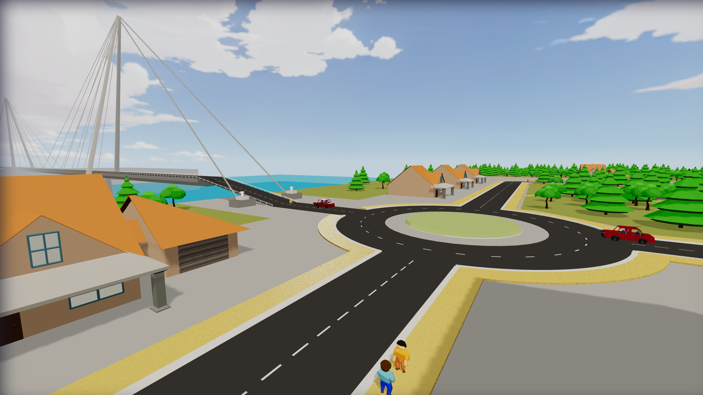
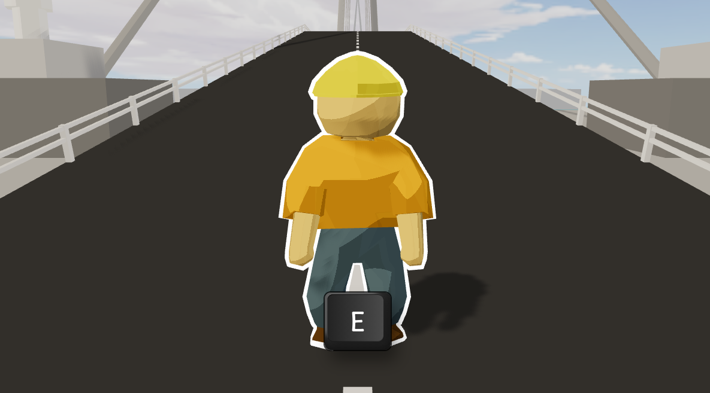
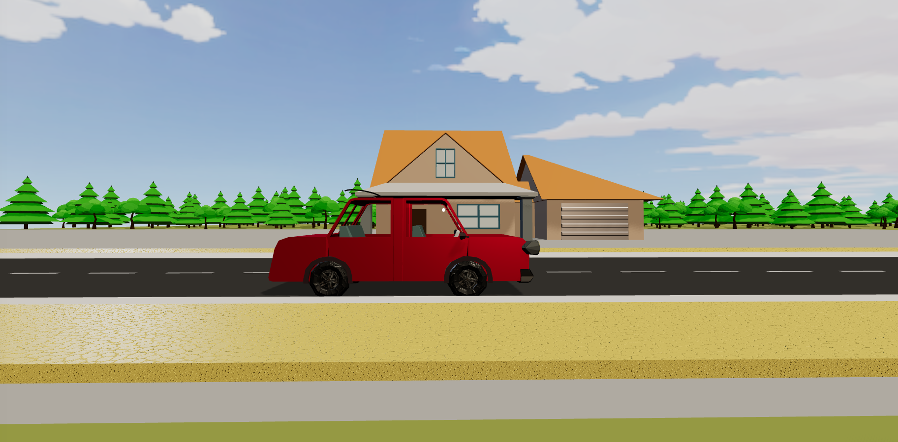
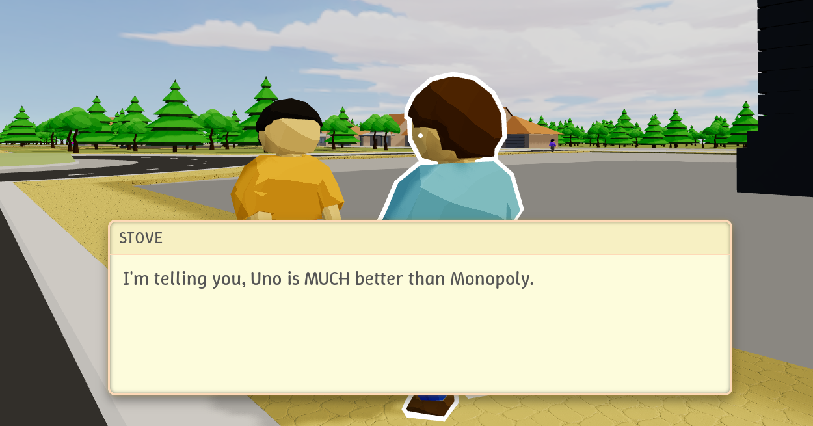

# Break Fast

A 3D toon-shaded browser game, built with [Three.js](https://threejs.org/), about wanting to go on a break — *fast*.

Developed as the final project for the [Introduction to Computer Graphics](https://www.ua.pt/pt/uc/7930) course.

| | |
|---|---|
| **Student** | António Santos |
| **Student Number** | 119139 |
| **Project** | Break Fast |
| **Play it** | https://apmds.github.io/break-fast/ |
| **Repository** | https://github.com/Apmds/break-fast |
| **Demo video** | https://youtu.be/bWgc4wmrxR8 |

> The latest gameplay changes are documented in [CHANGELOG.md](CHANGELOG.md) — everything added since the release.

## About

You've waited ages for a vacation. The only road out of town crosses a bridge that's *just* finished construction. BUT it can't open until "The Boss" of the construction crew signs off, and nobody knows where he is. So you set off through the small city on foot to track him down, chatting with its inhabitants along the way, before finally getting in your car and driving off into your well-earned break.



## Features

**Rendering & art style**
- Cel/toon shading style.
- Custom outline shader (`assets/shaders/outline/`) that highlights interactable objects on hover.
- Skybox and distance fog.
- Both baked static and dynamic shadows (see [CHANGELOG.md](CHANGELOG.md)).



**World & physics**
- (mostly) Hand-built city: houses, roads, sidewalks, trees, park and a bridge. City hall and restaurant are models from sketchfab.
- Physics for player movement, collisions and map boundary walls.
- Hundreds of procedurally placed, instanced trees making a big forest around the city.
- Path-following objects: objects that walk along predefined paths (a self-driving car loops the city, NPCs walk set routes)



**Characters & dialogue**
- NPCs with a scripted, branching **dialogue system**: typewriter text, per-line speed, triggered animations, and Animal-Crossing-style grunt "speech" with different pitch per-character.
- Multiple characters roaming around the city or waiting to give out quests, each able to have custom outfits.
- Player model rigged and animated via Mixamo; every world object can play actions through its own animation mixer.



**Items & progression**
- Items can be picked up in the world (there's multiple, not just the glasses)
- Some NPC quests are required for some items.
- After completing the game, there's an end scene showing all items collected..


**Platform & UX**
- Loading screen with a progress bar while assets stream in.
- Main menu and pointer-lock controls on desktop.
- Mobile / touch support: on-screen joystick and action buttons, with desktop-only hints hidden on touch devices.

## Controls

The game features both desktop (**recommended**) and mobile controls.

### Desktop:

- **WASD**: Move character
- **Mouse**: Move camera
- **Space**: Jump
- **Shift**: Run
- **E**: Interact
- **Esc**: Unlock mouse

### Mobile:

- **Left joystick**: Move character
- **Right joystick**: Move camera
- **Up arrow button**: Jump
- **Dot button**: Interact


## Running

This project was created with Vscode [live server](https://marketplace.visualstudio.com/items?itemName=ritwickdey.LiveServer) extension, so using it is the most direct way of running the project.

If VScode is not available or you don't like vscode, just run `python -m http.server` and open `localhost:8000` in the browser.

## Tech stack

- [Three.js](https://threejs.org/): rendering
- [cannon-es](https://github.com/pmndrs/cannon-es): physics / collisions
- [lil-gui](https://lil-gui.georgealways.com/): debug UI
- [blender](https://blender.org/): 3D modelling

## AI usage

AI was used extensively throughout the development process for learning tools (mostly blender) and for discussing ideas such as where performance could be updated.

These are some concrete examples of specific tasks that were assisted by AI:

**Google Gemini**
- Guidance for operating Blender. [This conversation](https://gemini.google.com/share/d86d77640eaa) was my main source of dependen.
- Created most of the final CSS (some of it is credited with appropriate links).

**GitHub Copilot**
- Integrating the outline shader with the bone animations.
- Translating the camera controls from my original C implementation into JavaScript.

**Claude**
- Implemented the mobile controls.
- Created the animated lines on the "item acquired" menu (see [`src/index.js`](src/index.js) (`make_item_ring_lines`) and [`src/style.css`](src/style.css) (`.line` / `@keyframes pulse`): `https://claude.ai/share/41278cda-119b-4647-9a0b-42f5d6266fd0`).
- Helped implement the audio system.
- Debugging.

All design decisions for the project structure and visual identity were entirely created by me.

## Repository structure

```text
break-fast/
├── index.html                  # GitHub Pages entry — redirects to src/index.html
├── favicon.ico
├── package.json                # Vite + Three.js + cannon-es dependencies
├── vite.config.js
├── shell.nix
├── links.txt                   # Asset & reference credits
├── README.md
├── CHANGELOG.md                # Changes since the release
│
├── assets/                     # Runtime assets loaded by the game
│   ├── models/                 # .glb models
│   │   ├── Buildings/          #   city hall, DcMonalds (+ pole / ground), house
│   │   ├── Cars/               #   car
│   │   ├── Objects/            #   parasol, straw hat, sunglasses
│   │   └── People/             #   citizen
│   ├── textures/               # pavement (PavingStones145), toon ramps
│   ├── skybox/                 # cubemap faces (px / nx / py / ny / pz / nz)
│   ├── shaders/outline/        # outline.vert / outline.frag
│   ├── sounds/                 # grunt SFX
│   └── item_thumbnails/        # item UI icons
│
├── src/
│   ├── index.html              # Game page — UI overlays, menus, HUD
│   ├── index.js                # Bootstrap entry point
│   ├── style.css
│   │
│   ├── city/                   # Scene & world building
│   │   ├── city.js             #   main scene: layout, lights, shadows, physics, trees
│   │   ├── bridge.js
│   │   ├── road.js
│   │   ├── sidewalk.js
│   │   ├── water.js            #   toon water shader
│   │   ├── skybox.js
│   │   ├── trees.js            #   instanced tree placement
│   │   └── end_scene.js        #   drive-off ending
│   │
│   ├── objects/                # World-object hierarchy
│   │   ├── world_object.js     #   base class: model, physics body, path-following
│   │   ├── path.js
│   │   ├── buildings/          #   city_hall, dcmonalds (+ pole / ground), house
│   │   ├── items/              #   base_item, parasol, straw_hat, sunglasses, placeholder
│   │   └── other/              #   car
│   │
│   ├── people/                 # NPCs & dialogue
│   │   ├── citizen.js
│   │   ├── boss_citizen.js
│   │   ├── builder_citizen.js
│   │   ├── conversation.js
│   │   └── conversationText.js
│   │
│   ├── player/                 # player.js, camera_controls.js
│   ├── data/                   # dialogue_map.js (script), object_paths.js (asset manifest)
│   ├── ui/                     # main_menu.js, debug_ui.js
│   └── utils/                  # scene, renderer, game_manager, input_manager,
│                               #   object_manager, ui_utils, debug_utils, road
│
├── docs/                       # Course deliverables
│   ├── proposal/               #   concept art + proposal PDF
│   ├── intermediate/           #   intermediate report + presentation
│   └── final/                  #   final presentation + image gallery
│
├── mockups/                    # Early design mockups
└── proj_files/                 # Source art — Blender (.blend), Mixamo anims, raw textures
```

## References

**Tutorials & documentation**
- [mojoGameDev — *Simple Blender Clothing Tutorial That Actually Works!*](https://www.youtube.com/watch?v=FdD-wY_-s2w)
- [Joey Carlino — *Rigging for impatient people* (Blender)](https://www.youtube.com/watch?v=DDeB4tDVCGY)
- [Joey Carlino — *Character animation for impatient people* (Blender)](https://www.youtube.com/watch?v=GAIZkIfXXjQ)
- [Blender reference manual](https://docs.blender.org/manual/en/latest/)
- [Three.js documentation](https://threejs.org/docs/)
- [Learn OpenGL](https://learnopengl.com/)

**Models**
- [novusod — McDonalds model (Sketchfab)](https://sketchfab.com/3d-models/mcdonalds-a72810b3252e47ee9072d8fa34599379)
- [Dybo — Utrecht Stadhuis / City Hall (Sketchfab)](https://sketchfab.com/3d-models/utrecht-stadhuiscity-hall-4853a41f3ef4437d812bd80571fc4d67)

**Materials & textures**
- [Skybox — sky_14 (freestylized)](https://freestylized.com/skybox/sky_14/)
- [Pavement — PavingStones145 (ambientCG)](https://ambientcg.com/view?id=PavingStones145)
- [Tire material (texturecan)](https://www.texturecan.com/details/575/)
- [Wheel rim texture (Freepik)](https://www.freepik.com/free-psd/sleek-black-alloy-wheel-3d-render-modern-car-rim_409843455.htm)
- [Straw texture — by freestockcenter (Magnific)](https://www.magnific.com/free-photo/horizontal-yellow-close-up-geometric-macro_1066043.htm)

**Visual references**
- [rotblush — Stylized Trees Bundle 01 (Sketchfab)](https://sketchfab.com/3d-models/stylized-trees-bundle-01-984279c90ffb46ed8c1ecccbacfd0ae8)
- [House model reference image](https://external-content.duckduckgo.com/iu/?u=https%3A%2F%2Flovehomedesigns.com%2Fwp-content%2Fuploads%2F2022%2F08%2FOpen-3-Bed-New-American-Farmhouse-with-3-Car-Garage-325902800-1-1.jpg.webp&f=1&nofb=1&ipt=1b987b8cfab4d677ee0a447d294e50d98c5f27ded01c52e9823480c36bf3eb26)
